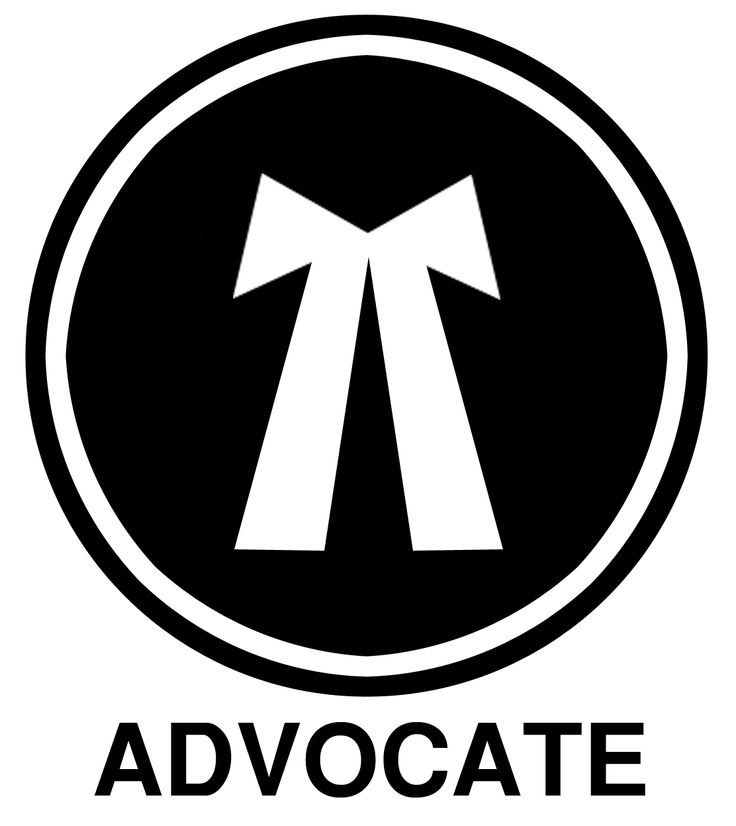

<!DOCTYPE html>
<html lang="en">
<head>
    <meta charset="UTF-8">
    <meta name="viewport" content="width=device-width, initial-scale=1.0">
    <meta name="description" content="Official Website of Advocate Swarup Das">
    <title>Advocate Swarup Das</title>
    <link rel="preconnect" href="https://fonts.googleapis.com">
    <link rel="preconnect" href="https://fonts.gstatic.com" crossorigin>
    <link href="https://fonts.googleapis.com/css2?family=Roboto:wght@400;700&family=Playfair+Display:wght@700&display=swap" rel="stylesheet">
    
</head>
<body>

<header>
    
    <h1>Advocate Swarup Das</h1>
    
Practicing Advocate, in Civil, Criminal & Contractual Matters

    
Enrolled with Bar Council of West Bengal in the year 2020

    
Fluent in Bengali, Hindi, and English | Based in All over West Bengal, India

</header>

    
<strong>Disclaimer:</strong> This website is meant only for providing basic information to clients about the advocate and does not amount to advertisement or solicitation. The user voluntarily accesses this website for informational purposes.

<nav>
    <a href="#about">About Me</a>
    <a href="#practice">Practice Areas</a>
    <a href="#contact">Contact</a>
</nav>

<section id="about">
    <h2>About Me</h2>
    

        
        
I am Swarup Das, an independent legal practitioner enrolled with the Bar Council of West Bengal. Since 2020, I have been actively providing legal services with a focus on civil, criminal, and contractual matters.

        
Over the years, I have built a reputation for offering honest, ethical, and timely legal assistance to individuals and organizations. My approach is client-centric and solutions-oriented — ensuring that each case is handled with utmost dedication, professionalism, and integrity.

        
I believe that access to justice is a fundamental right, and I strive to make quality legal services available to clients across India, regardless of their location or background.

        
Whether you are facing a legal dispute, require strategic legal advice, or need assistance with documentation and compliance — I am here to guide you with clarity and confidence.

    

</section>

<section id="practice">
    <h2>Practice Areas</h2>
    <ul>
        <li>Civil Disputes</li>
        <li>Criminal Defense</li>
        <li>FIR, Bail Matters etc.</li>
        <li>Property & Land Litigation</li>
        <li>Contract Law</li>
        <li>Legal Drafting & Documentation</li>
        <li>Power of Attorney</li>
        <li>Succession Certificate</li>
        <li>Legal Heir Certificate</li>
        <li>Name Change / Correction</li>
        <li>Divorce</li>
        <li>Maintenance</li>
        <li>Probate of Will</li>
        <li>Cheque Bouncing Cases</li>
        <li>Sale Deed and Transfer Deed Registration in India</li>
        <li>All Types of Affidavit</li>
        <li>Legal Consultation (Online & Offline)</li>
    </ul>
</section>

<section id="contact" class="contact">
    <h2>Contact</h2>
    
<strong>Email:</strong> <a href="mailto:swarupscience@gmail.com">swarupscience@gmail.com</a>

    
<strong>Phone:</strong> +91-8918135367

    
<strong>WhatsApp:</strong> +91-8918135367

    
<strong>Address:</strong> Village & Post - Pritinagar, P.S - Ranaghat, District - Nadia, West Bengal, Pin - 741247, India

    
<strong>Consultation:</strong> Available via Google Meet / Zoom

</section>

<a href="https://wa.me/918918135367" target="_blank" class="whatsapp-chat">💬</a>

<footer>
    
&copy; 2025 Advocate Swarup Das

</footer>

</body>
</html>
